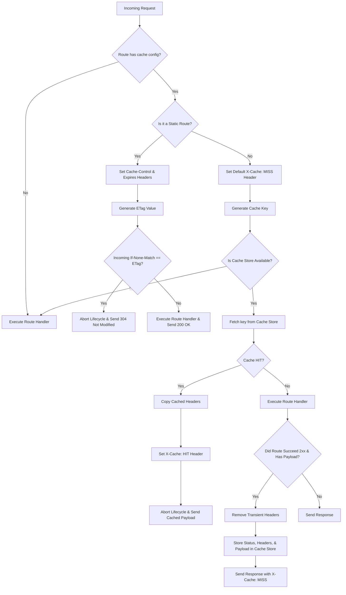

# Route-Based Caching System Architecture

This document describes the design, implementation, request lifecycle flow, and usage guidelines for the route-based caching system in our Fastify application.

---

## 1. Requirement Overview

The caching system is built to satisfy two distinct caching paradigms:

### A. Static Assets (Client-Side & CDN Caching)

- **Goal:** Instruct browsers, CDNs, and downstream proxies to store assets, avoiding redundant network requests.
- **Headers Managed:** `Cache-Control` (public cacheable), `Expires` (explicit absolute GMT freshness date), and `ETag` (unique content version identifier).
- **Conditional Requests:** Automatically inspect the incoming `If-None-Match` header to serve lightweight `304 Not Modified` responses instantly when the content is unchanged.

### B. Backend APIs & Database Queries (Server-Side Caching)

- **Goal:** Intercept incoming requests to expensive API routes and serve pre-generated responses from memory or Redis, bypassing database queries and route handler computation.
- **Storage Backend:** **Redis** for distributed production scaling, with an automatic, resilient **in-memory LRU cache fallback** for development and local testing.
- **Granular Scoping:** Configurable on a per-route basis with customizable Time-To-Live (TTL) values, defaulting to **24 hours**.
- **Dynamic Keying:** Cache keys must be highly specific, serializing the HTTP method, request path, sorted query parameters, non-volatile headers, and request body (for POST/PUT query-like API caching).

---

## 2. Architectural Approach

We designed a **hybrid, non-intrusive caching engine** composed of:

1. **Self-Contained Caching Plugin (`plugins/caching.ts`):** Wrapped in `fastify-plugin` to register decorators, type extensions, and hooks globally so they are accessible to any route in the application.
2. **Resilient Connection Manager:** A connection wrapper that attempts a fast-failing Redis connection in development, catches socket errors, registers an active silent error listener to prevent reconnect loops, and gracefully falls back to an in-memory LRU client.
3. **Promise-Wrapper Resolver:** Because `@fastify/caching`'s internal ETag hook expects callback-based `abstract-cache` drivers, setting `useAwait: true` would hang the ETag hook indefinitely. We configured the cache store with callbacks, and wrote custom, fully-typed `getCachedItem` and `setCachedItem` Promise wrappers to keep our route hooks modern and async/await-based.
4. **Hook-Based Interception:**
   - `preHandler`: Performs cache lookups (server-side) or sets ETag/Expires headers and executes conditional `304 Not Modified` checks (client-side).
   - `onSend`: Catches successful `2xx` route payloads and serializes them into the cache.

---

## 3. Caching Request Lifecycle Flow

Below is the request lifecycle flowchart showing how incoming requests are processed by our caching hooks:



---

## 4. Implementation Layout

The refactored implementation is split cleanly across these files:

- **`src/types/fastify.d.ts`:** Global typescript module augmentation. Adds typing configurations to `FastifyContextConfig` (`cache.ttl`, `cache.static`, `cache.cacheControl`) and `FastifyRequest` (`_cacheKey`).
- **`src/plugins/caching.ts`:** The global caching engine plugin. Contains the Redis connection, LRU fallback, Promise wrappers, key generator, `preHandler` interceptor, and `onSend` caching hook.
- **`src/controllers/v1/index.ts` & `src/controllers/v1/auth/user.ts`:** Route controllers that register endpoints under prefixes and use caching options inline.
- **`src/index.ts`:** Minimal startup entrypoint that registers the caching plugin and routes.

---

## 5. System Impact

- **Performance Boost:** Cache hits are resolved in the `preHandler` hook in **< 1ms**, bypassing serialization, database lookups, and route handler compute.
- **Reduced Database Pressure:** Repetitive or heavy lookup queries are bypassed, protecting SQL/NoSQL databases from traffic spikes.
- **Resilient Infrastructure:** The automatic fallback to the local in-memory LRU client ensures that the backend remains fully functional in local development or if the Redis instance goes offline.
- **Bandwidth Optimization:** Static assets conditional requests return immediately with `304 Not Modified` headers containing **0 body bytes**, reducing network payload egress significantly.

---

## 6. When to Use & When Not to Use Caching

### When to Use Caching

- **Read-Heavy API Routes:** Routes that fetch data that changes infrequently (e.g. `/v1/products`, `/v1/users/profile`, `/v1/settings`).
- **Resource-Heavy Calculations:** Computations, reporting, or heavy aggregations that take significant processing power.
- **Static Assets & Public Egress:** Images, avatars, scripts, or JSON configurations that only update on new deployments or updates.

### When NOT to Use Caching

- **Real-Time Data:** Volatile or live-streaming data (e.g. stocks, chats, real-time metrics).
- **Write/Mutating Routes:** Never cache routes that perform writes, creations, or deletions (`POST`, `PUT`, `DELETE` operations) unless they are query-like search endpoints.
- **User-Private Personal Data:** Do not cache private details unless you enforce a highly secure, user-specific `keyGenerator` to prevent data leakage between user sessions.

---

## 7. Per-Route Configuration & Usage

Enabling caching on any route in your application is simple. Simply define the `config.cache` properties inside your route options:

### A. Dynamic API Route Response Caching

Intercepts the request and caches the payload server-side:

```typescript
import type { FastifyInstance, FastifyRequest, FastifyReply } from 'fastify'

export default async function productController(fastify: FastifyInstance): Promise<void> {
  fastify.get(
    '/list',
    {
      config: {
        cache: {
          ttl: 300 // Cache products list response server-side for 5 minutes (300 seconds)
        }
      }
    },
    async (request: FastifyRequest, reply: FastifyReply) => {
      // Expensive DB query
      const products = await fetchProductsFromDb()
      return reply.code(200).send(products)
    }
  )
}
```

### B. Client-Side Static Asset Caching

Sets standard Cache-Control, Expires, and ETag headers, and checks conditional `If-None-Match` requests synchronous:

```typescript
import type { FastifyInstance, FastifyRequest, FastifyReply } from 'fastify'

export default async function assetController(fastify: FastifyInstance): Promise<void> {
  fastify.get(
    '/logo.png',
    {
      config: {
        cache: {
          static: true, // Tells caching hook to manage client-side headers instead of Redis
          ttl: 86400 // Expires exactly 24 hours from current time
        }
      }
    },
    async (request: FastifyRequest, reply: FastifyReply) => {
      const imageBuffer = await readLogoImageFile()
      return reply.code(200).type('image/png').send(imageBuffer)
    }
  )
}
```
