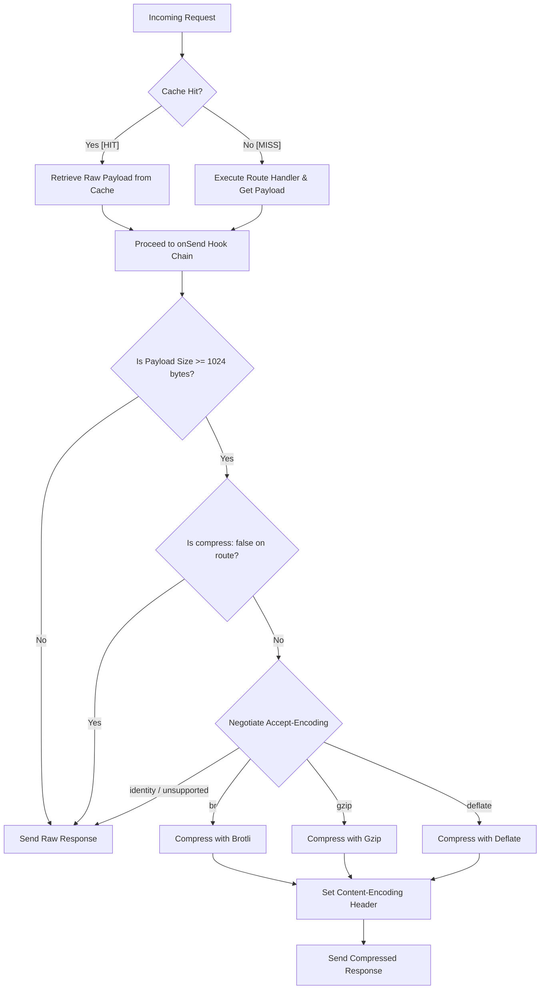

# Response Compression System Architecture

This document describes the design, implementation, request lifecycle flow, and usage guidelines for the response compression system in our Fastify application.

---

## 1. Requirement Overview

The response compression system is built to minimize bandwidth consumption and speed up page and data delivery for our SaaS backend:

### A. Automatic Payload Compression
- **Goal:** Dynamically compress outgoing payloads that exceed a specific size threshold before they are sent to the client.
- **Size Threshold:** Configured at **1024 bytes (1KB)** to prevent the overhead of compressing very small payloads (which could inadvertently increase the packet size).
- **Supported Encodings:** Automatically negotiates and uses the most efficient algorithm requested by the client's `Accept-Encoding` header:
  1. `br` (Brotli) - Highest compression ratio for modern web clients.
  2. `gzip` - Broadly compatible fallback standard.
  3. `deflate` - Legacy fallback format.
  4. `identity` - Zero compression.

### B. Route-Based Customization
- **Goal:** Grant developers granular control to override global compression settings per endpoint.
- **Disable Compression:** Setting `compress: false` disables compression completely (useful for large files that are already compressed, e.g. zip/images, to avoid redundant CPU usage).
- **Custom threshold / options:** Configure individual thresholds or custom compressors inline inside route options.

---

## 2. Architectural Approach

We integrated response compression seamlessly using `@fastify/compress`:

1. **Deterministic Execution Order:**
   - Registers `@fastify/compress` **after** the `cachingPlugin` in `src/index.ts`.
   - This ensures that server-side caching (Redis / in-memory LRU) caches the **uncompressed, raw payload** (along with raw headers).
   - When a cache hit occurs, the uncompressed payload is resolved in `preHandler`, and `@fastify/compress`'s `onSend` hook dynamically compresses the payload according to that specific request's `Accept-Encoding` header. This prevents the risk of serving a gzipped cache item to a client that does not support gzip.

2. **Node.js Native Streams & Zlib Integration:**
   - Under the hood, the plugin leverages Node's native zlib streams to perform high-efficiency Brotli and Gzip compression with minimal heap memory usage.

---

## 3. Compression Request Lifecycle Flow

Below is the request lifecycle flowchart showing how incoming requests are processed by both Caching and Compression hooks:



---

## 4. Implementation Layout

The compression changes are cleanly integrated across the codebase:

- **`src/types/fastify.d.ts`:** Automatically extended by `@fastify/compress` type definitions, offering full auto-completion for `compress` options on all routes.
- **`src/controllers/v1/auth/user.ts`:** Implements `/large-data` (default compression) and `/no-compression` (explicitly bypassed) to test and demonstrate configurations.
- **`src/index.ts`:** Entrypoint registers the plugin globally with the 1KB threshold:
  ```typescript
  await fastify.register(fastifyCompress, {
    threshold: 1024,
  })
  ```

---

## 5. System Impact

- **Network Bandwidth Savings:** Reduces transfer sizes by up to **70%** for text-heavy formats (JSON, HTML, CSS), cutting cloud data egress costs.
- **Enhanced LCP (Largest Contentful Paint):** Modern browsers receive and unpack gzipped/brotli payloads significantly faster, improving user-perceived load time.
- **CPU vs Bandwidth Balance:** The 1KB threshold avoids wasting CPU cycles on tiny responses that wouldn't benefit from compression.

---

## 6. When to Use & When Not to Use Compression

### When to Use
- **Large JSON REST API responses:** E.g., paginated `/v1/products` or `/v1/users/list` responses.
- **Static Assets:** E.g., text, HTML pages, JS bundles, and large custom SVGs.
- **Dynamic HTML/Text rendering endpoints.**

### When NOT to Use
- **Binary formats that are already compressed:** E.g., JPEG, PNG, ZIP, MP4, PDF files. Bypassing compression for these via `compress: false` saves valuable CPU cycles.
- **Small payloads (< 1KB):** Automatically bypassed via our configured `threshold: 1024` limit.

---

## 7. Per-Route Configuration & Usage

Enabling or disabling compression on specific routes is straightforward:

### A. Default Dynamic Compression (Automatic)
Responses exceeding 1024 bytes are automatically compressed:
```typescript
fastify.get('/large-data', async (request, reply) => {
  return reply.code(200).send({ data: 'A'.repeat(2000) })
})
```

### B. Explicitly Disabling Compression
Useful for already compressed static assets or media files to conserve server CPU:
```typescript
fastify.get('/download-zip', {
  compress: false
}, async (request, reply) => {
  const zipBuffer = getZipFileBuffer()
  return reply.code(200).type('application/zip').send(zipBuffer)
})
```

### C. Custom Compression Settings per Route
Customize threshold or algorithms for special routes:
```typescript
fastify.get('/custom-route', {
  compress: {
    threshold: 512, // Compress if response is larger than 512 bytes
  }
}, async (request, reply) => {
  return reply.code(200).send({ msg: 'Custom compressed route' })
})
```
