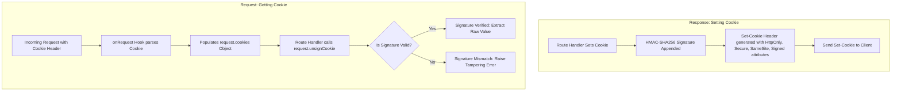

# Cookie Parsing & Signing Architecture

This document describes the design, security specifications, request lifecycle flow, and usage guidelines for the cookie parser and signing system in our Fastify application.

---

## 1. Requirement Overview

The cookie parser system is built using `@fastify/cookie` to allow safe, client-tamper-proof management of server-side state (like authentication tokens or session IDs):

### A. Automatic Cookie Parsing

- **Goal:** Parse incoming HTTP `Cookie` headers automatically so they are made available as a structured object on requests.
- **Hook Integration:** Automatically hooks into Fastify's `onRequest` lifecycle stage so that cookies are parsed before any downstream plugins or handlers run.

### B. Secure Cookie Signing & Tamper Resistance

- **Goal:** Sign set cookies with a cryptographically secure signature, allowing the server to verify that the client has not tampered with the cookie values.
- **Secret Key:** Loaded dynamically from `process.env.COOKIE_SECRET` with a secure development fallback.
- **Algorithm:** Uses standard HMAC-SHA256 signatures to attach signature hashes to cookies.
- **Verification:** Automatically unsigns and validates the cookie's integrity using `request.unsignCookie()`.

---

## 2. Architectural Approach

1. **Top-Level Priority Hook Registration:**
   - `@fastify/cookie` is registered as the **very first plugin** inside `src/index.ts`.
   - This guarantees that cookies are parsed immediately when a request hits the server, making `request.cookies` available to the `cachingPlugin` (which could use cookie parameters in its cache key generator) and all route handlers.

2. **Defense-In-Depth Security Options:**
   Every cookie set in production should strictly leverage the following defensive headers:
   - **`HttpOnly: true`:** Prevents clientside JavaScript (e.g. `document.cookie`) from reading the cookie, neutralizing Cross-Site Scripting (XSS) session hijacking.
   - **`Secure: true`:** Restricts the cookie to HTTPS-only connections to prevent packet sniffing over plain text HTTP (disabled in local HTTP development).
   - **`SameSite: 'lax'` or `'strict'`:** Mitigates Cross-Site Request Forgery (CSRF) attacks by blocking browsers from sending cookies on cross-origin requests.

---

## 3. Cookie Verification Lifecycle Flow

Below is the request/response lifecycle flowchart showing how signed cookies are set and verified:



---

## 4. Implementation Layout

The cookie system is cleanly integrated across the codebase:

- **`src/types/fastify.d.ts`:** Automatically extended by `@fastify/cookie` to provide native TypeScript compiler definitions for `request.cookies`, `request.unsignCookie()`, and `reply.setCookie()`.
- **`src/controllers/v1/auth/user.ts`:** Implements testing endpoints:
  - `/set-cookie`: Issues a signed, HttpOnly, SameSite cookie.
  - `/get-cookie`: Reads the cookie, unsigns it, and validates its signature.
- **`src/index.ts`:** Bootstraps the plugin with a secure secret loading process:

  ```typescript
  const cookieSecret = process.env.COOKIE_SECRET || 'default_super_secure_cookie_signature_secret_key_32_chars'

  await fastify.register(fastifyCookie, {
    secret: cookieSecret
  })
  ```

---

## 5. System Impact

- **Tamper-Proof Session Management:** Signed cookies prevent clients from forging session IDs or user IDs, keeping authorization mechanisms robust.
- **Complete XSS Protection:** Enforcing `httpOnly: true` blocks malicious script access to sensitive session cookies.
- **Type-Safe Request Handlers:** Standard TypeScript definitions allow developers to read and write cookies without type-casting or raw string parsing.

---

## 6. Per-Route Configuration & Usage

### A. Setting a Signed, Secure Cookie

Always pass security parameters (`httpOnly`, `sameSite`, `signed`) when writing a cookie:

```typescript
fastify.get('/login', async (request, reply) => {
  return reply
    .setCookie('session_id', 'usr_123456', {
      path: '/',
      httpOnly: true,
      secure: process.env.NODE_ENV === 'production', // HTTPS only in prod
      signed: true,
      sameSite: 'lax',
      maxAge: 3600 // 1 hour TTL
    })
    .code(200)
    .send({ message: 'Logged in successfully' })
})
```

### B. Reading and Unsigning a Cookie

Never trust `request.cookies` values directly if they are signed; always verify the signature:

```typescript
fastify.get('/profile', async (request, reply) => {
  const rawCookie = request.cookies.session_id

  if (!rawCookie) {
    return reply.code(401).send({ error: 'Unauthorized' })
  }

  // Verify signature and extract the original value
  const verification = request.unsignCookie(rawCookie)

  if (!verification.valid) {
    return reply.code(400).send({ error: 'Invalid cookie signature' })
  }

  const userId = verification.value // e.g. "usr_123456"
  const user = await getUserFromDb(userId)
  return reply.code(200).send(user)
})
```

### C. Clearing a Cookie

Clearing requires passing the same options (`path`, etc.) to match the client's cookie record:

```typescript
fastify.get('/logout', async (request, reply) => {
  return reply.clearCookie('session_id', { path: '/' }).code(200).send({ message: 'Logged out successfully' })
})
```
