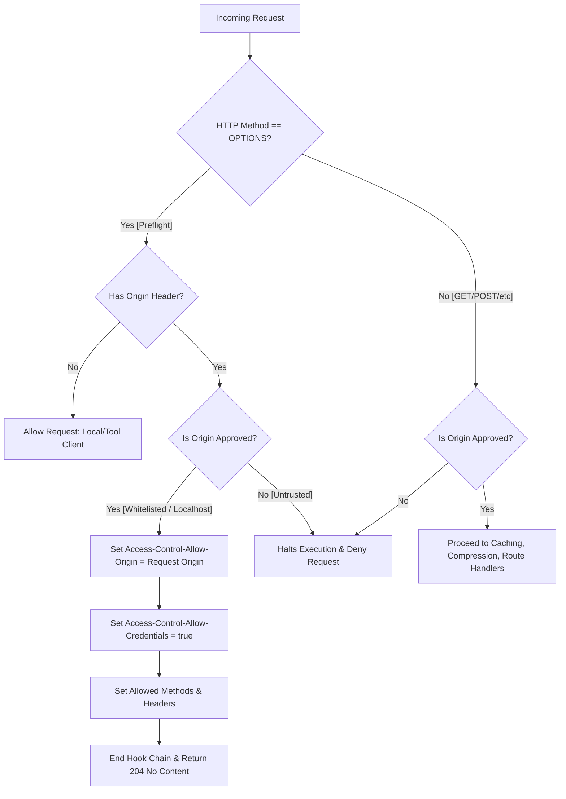

# Cross-Origin Resource Sharing (CORS) System Architecture

This document describes the design, security specifications, request lifecycle flow, and usage guidelines for the CORS security configuration in our Fastify application.

---

## 1. Requirement Overview

The CORS middleware is implemented using `@fastify/cors` to secure the backend API against unauthorized cross-origin requests while enabling authentic, authenticated interactions from trusted frontends:

### A. Environment-Based Whitelist matching

- **Goal:** Allow cross-origin requests originating only from explicitly approved origins configured in the system.
- **Dynamic Whitelist:** Read from a comma-separated environment variable `process.env.ALLOWED_ORIGINS` (e.g. `https://app.mydomain.com,https://admin.mydomain.com`).
- **Development Fallback:** In development/local environments, automatically allow any requests originating from `localhost` or `127.0.0.1` (on any port) to ensure seamless local frontend-backend development.

### B. Authenticated CORS (Signed Cookies Support)

- **Goal:** Enable the safe transmittal of signed session cookies (`@fastify/cookie`) across domains.
- **Specification Constraints:** Set `credentials: true`. Under standard security policies, this **strictly prohibits** the use of the wildcard `Access-Control-Allow-Origin: *` header. The server must dynamically match and return the specific requesting origin in the response.

---

## 2. Architectural Approach

1. **Preflight Optimization Hook Placement:**
   - CORS is registered as an early plugin in `src/index.ts` (immediately following `@fastify/cookie`).
   - Registers an `onRequest` hook that intercepts incoming `OPTIONS` preflight requests.
   - Responds instantly to preflight checks, bypassing down-funnel application execution (such as cache lookups, database queries, and routing logic) to conserve backend CPU and minimize latency.

2. **Reflective Origin Resolution:**
   - The origin checker is implemented using an asynchronous callback mechanism. If the origin is approved, it is reflected back in the `Access-Control-Allow-Origin` header, satisfying the `credentials: true` standard.
   - If the origin is unapproved, the callback returns an error (`Not allowed by CORS`), halting request processing immediately and returning an error to the browser.

---

## 3. CORS Preflight Lifecycle Flow

Below is the request/response lifecycle flowchart showing how preflight `OPTIONS` requests are resolved:



---

## 4. Implementation Layout

The CORS security configuration is integrated inside:

- **`src/index.ts`:** Register the plugin with the dynamic origin resolver:

  ```typescript
  await fastify.register(fastifyCors, {
    origin: (origin, callback) => {
      if (!origin) {
        callback(null, true)
        return
      }

      // 1. Read whitelist from environment
      const allowedList = process.env.ALLOWED_ORIGINS
        ? process.env.ALLOWED_ORIGINS.split(',').map(o => o.trim().toLowerCase())
        : []

      const originLower = origin.toLowerCase()
      if (allowedList.includes(originLower)) {
        callback(null, true)
        return
      }

      // 2. Automatically allow localhost in development
      try {
        const url = new URL(origin)
        if (url.hostname === 'localhost' || url.hostname === '127.0.0.1') {
          callback(null, true)
          return
        }
      } catch {
        // ignore malformed URLs
      }

      // 3. Deny untrusted origins
      callback(new Error('Not allowed by CORS'), false)
    },
    credentials: true
  })
  ```

---

## 5. System Impact

- **Hardened Security Boundaries:** Unauthorized domains cannot access APIs or scrape data.
- **Cookie Security Maintenance:** Seamlessly aligns with our signed secure cookie parser to allow safe cookie-based user session handling without exposing credentials to untrusted sites.
- **Zero Overhead on Preflights:** Preflight checks are resolved instantly at the `onRequest` hook stage.

---

## 6. How to Configure Allowed Origins

### A. Development Mode (Default)

By default, all localhost addresses are permitted. No environment configuration is needed for local development:

- Allowed: `http://localhost:3000`, `http://localhost:5173`, `http://127.0.0.1:8080`.
- Blocked: `http://externaldomain.com`.

### B. Production Mode

Configure `ALLOWED_ORIGINS` in your environment files:

```env
ALLOWED_ORIGINS=https://app.yourdomain.com,https://admin.yourdomain.com
```

Origins are automatically stripped of spaces and matched case-insensitively.
