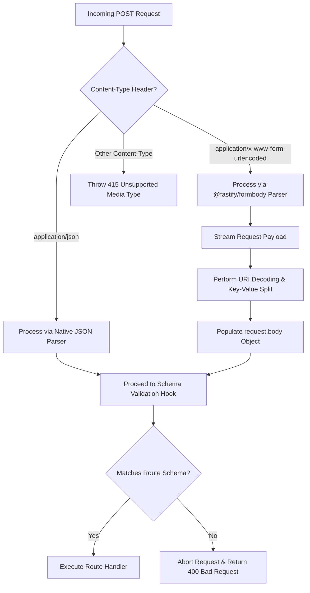

# URL-Encoded Form Body Parser Architecture

This document describes the design, content-type parsing lifecycle, performance considerations, and usage guidelines for the formbody parser middleware in our Fastify application.

---

## 1. Requirement Overview

The formbody parser is integrated using `@fastify/formbody` to support standard HTML form submissions and integrations that leverage form URL-encoded payloads:

### A. Automatic parsing of Form Data

- **Goal:** Enable parsing of payloads with the `application/x-www-form-urlencoded` Content-Type.
- **Payload Format:** Standard URL-encoded strings (e.g. `username=john_doe&role=admin`).
- **Parsing Output:** Decodes percent-encoded characters and converts the flat key-value pairs into a structured Javascript Object accessible at `request.body`.

### B. High Performance & Compatibility

- **Goal:** Align form body parsing with Fastify's native high-performance architecture.
- **Extensibility:** Built to support standard schema validators (like TypeBox or custom JSON schemas) to ensure request payloads match strict parameters before handlers are executed.

---

## 2. Architectural Approach

1. **Content-Type Parser Hook Integration:**
   - Fastify's native body parser handles `application/json` automatically.
   - `@fastify/formbody` registers a custom content-type parser globally using Fastify's native `addContentTypeParser` API.
   - This ensures that when a request arrives with a matching `Content-Type: application/x-www-form-urlencoded` header, Fastify routes the raw request stream directly to the formbody parser instead of generating an unsupported content-type error.

2. **Parser Lifecycle Order:**
   - Content-type parsing runs during the **`preParsing`** and **`preValidation`** lifecycle stages.
   - This means the parsed payload is populated and fully available at `request.body` by the time Fastify runs schema validation, ensuring strict types can be enforced before route handlers begin execution.

---

## 3. Form Body Parsing Hook Pipeline

Below is the request lifecycle flowchart showing how URL-encoded payloads are parsed and validated:



---

## 4. Implementation Layout

The formbody parser is integrated inside:

- **`src/index.ts`:** Register the plugin globally:

  ```typescript
  import fastifyFormbody from '@fastify/formbody'

  // 3. Register Formbody Parser Plugin (Parses application/x-www-form-urlencoded payloads)
  await fastify.register(fastifyFormbody)
  ```

- **`src/controllers/v1/auth/user.ts`:** Implements testing POST route:
  - `/submit-form`: Declares a strongly-typed `SubmitFormBody` interface and returns the parsed request body parameters.

---

## 5. System Impact

- **Seamless Compatibility:** Easily supports incoming webhooks, third-party authentication redirects (like OAuth/SAML form POSTs), and standard HTML `<form>` submissions.
- **Zero Overhead on JSON Routes:** The parser is strictly invoked _only_ when the `Content-Type: application/x-www-form-urlencoded` header is explicitly provided.
- **Full Type Safety:** Interfaces and generic bounds bind parsed bodies, preventing the need for any un-typed/any variables in our handlers.

---

## 6. Route Integration & Usage

### A. Strongly Typed Route Definition

Always define the request body types using a dedicated interface to ensure compile-time verification:

```typescript
import type { FastifyRequest, FastifyReply } from 'fastify'

interface SubmitFormBody {
  username: string
  role: string
}

fastify.post<{ Body: SubmitFormBody }>(
  '/submit-form',
  async (request: FastifyRequest<{ Body: SubmitFormBody }>, reply: FastifyReply) => {
    const { username, role } = request.body // Fully type-safe strings!

    return reply.code(200).send({
      status: 'success',
      received: { username, role }
    })
  }
)
```

### B. Standard Curl Form Submission Test

Test the endpoint using curl's built-in form URL-encoding support (`--data`):

```bash
curl -i -X POST \
  -H "Content-Type: application/x-www-form-urlencoded" \
  --data "username=john_doe&role=admin" \
  http://127.0.0.1:4000/v1/auth/user/submit-form
```
