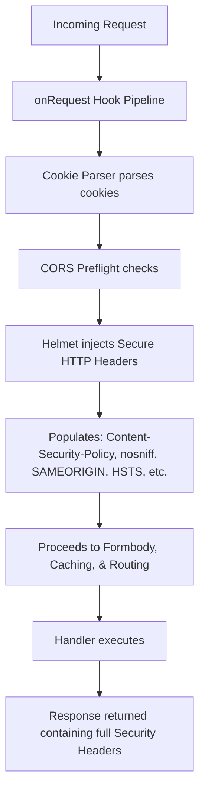

# HTTP Security Headers (Helmet) System Architecture

This document describes the design, implementation, secure headers configuration, and usage guidelines for the `@fastify/helmet` middleware in our Fastify application.

---

## 1. Requirement Overview

HTTP security headers are configured using `@fastify/helmet` to protect the backend services and users from common web attacks:

### A. Core Security Headers Applied
By registering `@fastify/helmet` with its standard defaults, the application automatically responds with the following standard HTTP headers:

- **`Content-Security-Policy` (CSP):** Restricts the sources of content (scripts, stylesheets, images, connections, fonts, media) that the browser is allowed to load for a given page, preventing Cross-Site Scripting (XSS) and data injection attacks.
- **`X-Content-Type-Options: nosniff`:** Instructs browsers to strictly respect the `Content-Type` header sent by the server, preventing browsers from MIME-sniffing a response into a different executable type (protecting against script injection via media uploads).
- **`X-Frame-Options: SAMEORIGIN`:** Protects users against clickjacking attacks by blocking the page from being rendered inside an iframe, object, or embed element on other domains.
- **`Strict-Transport-Security` (HSTS):** Enforces HTTPS connections globally by instructing browsers to exclusively use secure HTTPS tunnels when contacting this domain.
- **`X-Permitted-Cross-Domain-Policies: none`:** Disallows Adobe Flash and Acrobat PDF documents from loading data from this domain, preventing cross-domain information leakage.
- **`Referrer-Policy: no-referrer`:** Controls the amount of referrer information passed when navigating from this site to other origins.

---

## 2. Architectural Approach

1. **Early Injection Pipeline Hook:**
   - Registered immediately after the CORS plugin inside `src/index.ts`.
   - Runs as an early **`onRequest`** lifecycle hook.
   - This ensures security headers are set at the very first interaction step, guaranteeing that even error responses, preflights, or unauthorized requests return fully loaded security headers.

2. **Modular Configurations:**
   - Standard defaults are extremely secure and lightweight, requiring zero processing overhead.
   - The plugin exports full TypeScript definitions and can be customized inline to disable or override individual headers (like disabling CSP if a route serves HTML pages that embed external assets).

---

## 3. Helmet Hook Lifecycle Pipeline

Below is the request lifecycle flowchart showing how `@fastify/helmet` injects headers early:



---

## 4. Implementation Layout

The Helmet middleware is integrated inside:

- **`src/index.ts`:** Register the plugin globally immediately after CORS:
  ```typescript
  import fastifyHelmet from '@fastify/helmet'

  // 3. Register Helmet Security Headers Plugin (Applies standard HTTP security headers globally)
  await fastify.register(fastifyHelmet)
  ```
- **`decision/helmet.md`:** This design record.

---

## 5. System Impact

- **Hardened Server Environment:** Implements complete defense-in-depth protection against clickjacking, script injections, and HSTS policy enforcement.
- **Minimal Performance Impact:** Appending standard headers requires negligible CPU time and is handled natively by fastify response pipelines.
- **Production-Ready Compliance:** Helps the project achieve high security ratings on automated audits (e.g. Mozilla Observatory or Qualys SSL Labs).

---

## 6. How to Configure Helmet Options

### A. Standard Global Default (Current Setup)
Simply register the package globally:
```typescript
await fastify.register(fastifyHelmet)
```

### B. Customizing Headers (e.g. Custom CSP)
To allow script or image sources from external domains, pass custom parameters inline:
```typescript
await fastify.register(fastifyHelmet, {
  contentSecurityPolicy: {
    directives: {
      defaultSrc: ["'self'"],
      scriptSrc: ["'self'", "https://apis.google.com"],
      imgSrc: ["'self'", "https://images.unsplash.com"]
    }
  }
})
```

### C. Disabling Specific Headers (e.g. Disabling CSP)
To completely bypass Content-Security-Policy while maintaining other headers (useful for specific static templates or SPA routes):
```typescript
await fastify.register(fastifyHelmet, {
  contentSecurityPolicy: false
})
```
