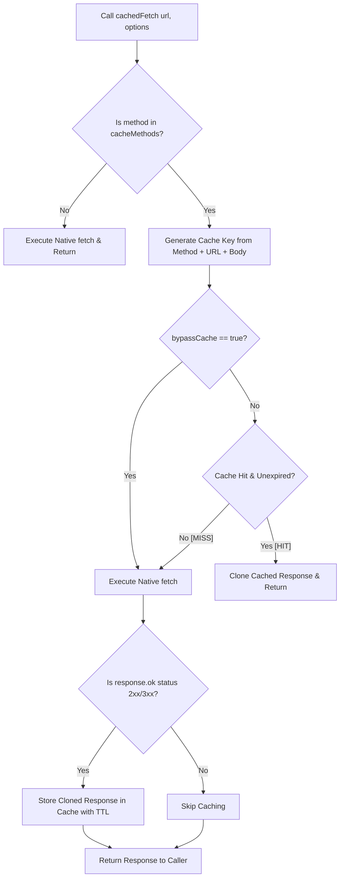

# Client-Side Network Fetch Caching Architecture

This document describes the design, implementation, cache key generation, and usage guidelines for the client-side cached fetch utility in our application.

---

## 1. Requirement Overview

The client-side fetch wrapper is built to prevent redundant API network requests, optimizing user experience and minimizing server-side database lookup load:

### A. In-Memory Request Caching
- **Goal:** Cache network responses dynamically using an in-memory storage driver, returning cached payloads instantly without initiating raw network requests.
- **Cache Key Matching Criteria:** Cache keys must uniquely identify a request based on:
  1. The target request URL (which natively contains query parameters).
  2. The HTTP request method (e.g. `GET`, `POST`).
  3. The request body (if present, serialized consistently for JSON, URL search params, and form data payloads).

### B. Configurable Cache Expiry (TTL)
- **Goal:** Allow callers to specify custom cache durations, defaulting to a **1-hour (3,600,000 ms)** fallback cache freshness TTL.

### C. Configurable Method Filtering
- **Goal:** Control which HTTP verbs are permitted for caching, defaulting to **`GET`** and **`POST`** requests.

### D. Specific & Dynamic Cache Invalidation
- **Goal:** Expose invalidation functions to manually bust cache entries. If `'all'` is passed, the entire cache store is cleared. Otherwise, a target URL string acts as a filter to invalidate specific endpoints.

---

## 2. Architectural Approach

1. **Native `fetch` Signature Alignment:**
   - The wrapper function `cachedFetch` mirrors the global `fetch` API signature. It takes a URL and optional request configuration options, returning a `Promise<Response>`.
   - This allows developers to drop `cachedFetch` directly into existing modules without refactoring downstream payload resolvers (`.json()`, `.text()`, etc.).

2. **In-Memory Response Cloning:**
   - A standard HTTP `Response` body stream is single-use and can only be read once.
   - To bypass this constraint, the cache store caches a cloned instance of the response (`response.clone()`).
   - When resolving a cache hit, a cloned copy of the cached response is returned to the caller. This allows multiple concurrent or sequential callers to read the same cached response body safely.

3. **Robust Cache Key Serializer:**
   - The key generator recursively serializes different request body formats, converting strings, `URLSearchParams`, `FormData` fields, and nested JSON payloads into a deterministic string representation.

---

## 3. Request Caching Flow

Below is the request/response lifecycle flowchart showing how `cachedFetch` resolves queries:



---

## 4. Implementation Layout

The cache utility is contained within the following file:
- **[src/app/network.ts](file:///Users/tanmay/Documents/poc/saas/src/app/network.ts):** Exposes `cachedFetch`, `clearCache`, and options configurations.

---

## 5. Usage & Configuration Guide

### A. Default GET Request Caching (1-Hour TTL)
Caches automatically using default configurations:
```typescript
import { cachedFetch } from './network'

// Initiates a network request
const res1 = await cachedFetch('https://api.example.com/items')
const data1 = await res1.json()

// Instant cache hit, no network request triggered
const res2 = await cachedFetch('https://api.example.com/items')
const data2 = await res2.json()
```

### B. Custom Cache Configurations
Modify caching thresholds, whitelist verbs, or force network lookups:
```typescript
const response = await cachedFetch('https://api.example.com/search', {
  method: 'POST',
  body: JSON.stringify({ query: 'saas' }),
  cacheTtl: 60000,           // Expire in 60 seconds (1 minute)
  cacheMethods: ['POST'],    // Cache POST requests only
  bypassCache: true          // Forces network update (updates cache with fresh data)
})
```

### C. Cache Invalidation (Manual Clearing)
Clear the cache using `clearCache()`:
```typescript
import { clearCache } from './network'

// Invalidate specific URL entries
clearCache('https://api.example.com/items')

// Clear the entire cache
clearCache('all')
```
