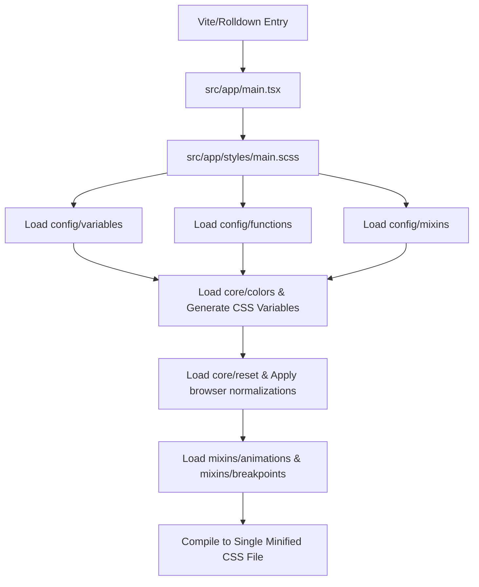

# Style Architecture & Design Philosophy

This document outlines the high-level architecture, directory layout, design philosophy, and module system of the Sass framework implemented in our SaaS application.

---

## 1. Architectural Philosophy

Our design system is built to achieve three primary goals:

1. **Modularity & Isolation:** Standardizing on Sass's modern `@use` module system to avoid global namespace pollution and collision issues common with legacy `@import` chains.
2. **Modern Color Representation (OKLCH):** Managing color ranges with OKLCH coordinates to ensure perceptually uniform lightness, predictable contrast, and excellent accessibility compliance.
3. **Accessibility First (A11y):** Natively integrating hooks to accommodate screen readers (`sr-only`), user focus styling, and user-level media preferences (such as disabling animations for `prefers-reduced-motion`).

---

## 2. Directory Structure

The framework is organized into distinct directories based on role:

```text
src/app/styles/
├── main.scss               # Main Sass Entry Point (registers and exports all styles)
├── config/                 # Foundation variables, functions, and mixins
│   ├── _variables.scss     # Design tokens (breakpoints, typography, shadows, radii)
│   ├── _functions.scss     # Math, unit conversions, and fluid sizing functions
│   └── _mixins.scss        # Breakpoint hooks and responsive class generators
├── core/                   # Baseline overrides and design cores
│   ├── _colors.scss        # OKLCH base colors and shade maps
│   └── _reset.scss         # A11y-conscious normalize/reset styles
└── mixins/                 # Feature-specific styling mixins
    ├── _animations.scss    # Animation, duration, and motion-reduction wrappers
    └── _breakpoints.scss   # User preference media query hooks
```

---

## 3. The Sass Module System (@use)

Unlike the legacy `@import` mechanism (which imports files globally), `@use` treats each Sass stylesheet as a distinct module.

### Key Rules

- **Encapsulated Scope:** Variables, functions, and mixins declared in a module are accessed using its filename as a namespace (e.g. `variables.$spacer` or `colors.$color-primary`).
- **No Redundant Compilation:** If a stylesheet is used multiple times, Sass compiles it only once, improving client bundling speeds significantly.
- **Controlled Exposure:** Shared tokens are clearly tracked, eliminating issues where developers guess whether a variable has been defined elsewhere.

---

## 4. Color Philosophy: Why OKLCH?

Our color engine is built entirely using the **OKLCH** color space (e.g., `oklch(L C H)`), which stands for:

- **Lightness (L):** Perceived brightness (0% to 100%).
- **Chroma (C):** Color saturation/intensity (0 to ~0.4).
- **Hue (H):** Color angle/tint (0 to 360).

### Advantages over RGB / HSL

1. **Perceptually Uniform Lightness:** In HSL, yellow (`hsl(60, 100%, 50%)`) looks significantly brighter than blue (`hsl(240, 100%, 50%)`) despite both having a "lightness" value of 50%. This makes creating accessible contrast pairs difficult. In OKLCH, a lightness of `60%` is guaranteed to look equally bright regardless of the Hue.
2. **Accessible Contrast Ratios:** Programmatic pairings (e.g. pairing a `40%` lightness background with a `95%` lightness text) guarantee readable contrast (meeting WCAG AA/AAA guidelines) across any hue.
3. **High Gamut Support:** OKLCH works natively inside P3 wide color gamuts in modern browsers, displaying richer, more vibrant colors on supported screens.

---

## 5. Compilation Pipeline

When Vite processes client-side styles, the build flow operates as follows:


